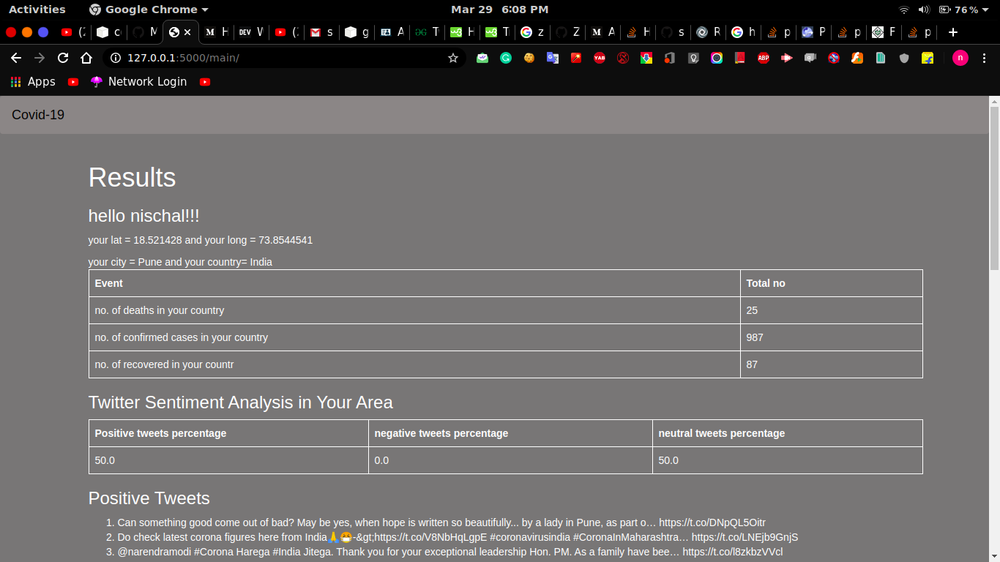
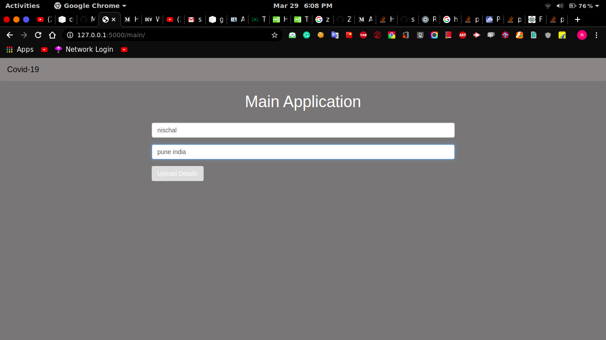
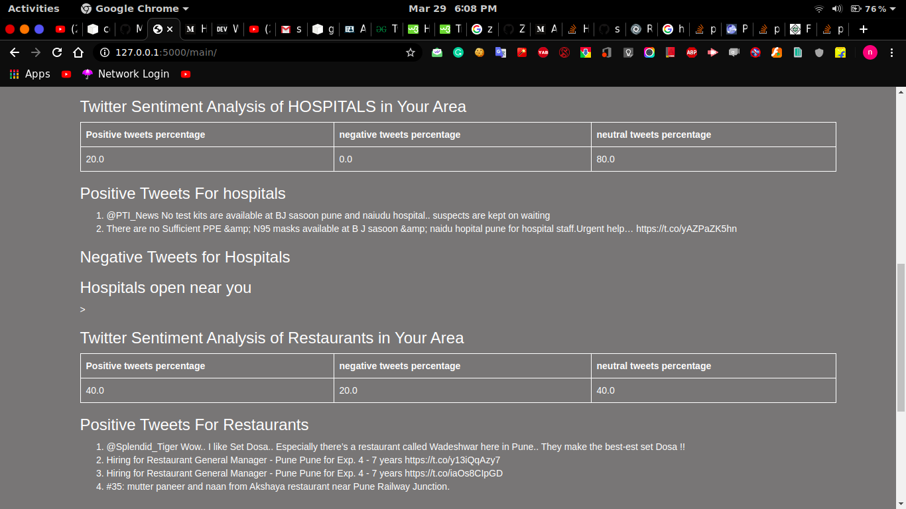
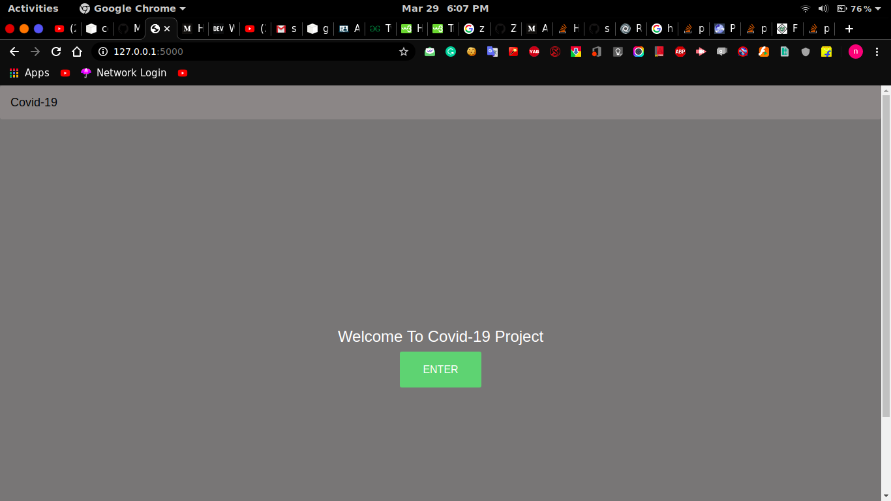

# Adhoc Networks Project

This is a project for adhoc networks hackathon 2020.

# Table of Contents

1.[Installation](#Installation)

2.[Setup](#Setup)

3.[Features](#Features)

a) Corona Database Scrapping

b) Detecting your location through city,country,state and GPS coordinates

c) Twitter sentiment Analysis of Corona near you, and hospitals,shops and restaurants near you. 
 
d) Scrapping Google Maps for hospitals near me


[Contact Me](#Contact-Me)

## Installation

1. Clone this repository.
2. Install the pre-requisites. To install via pip -


```bash
pip3 install -r requirements.txt
```

## Setup

1. Go into app.py and put your Twitter Developer account Access Keys.

2. Make sure you have Python3 and other dependencies installed.

3. Run -

```python
python3 app.py
```

5. Your server will now be up and running on - [http://127.0.0.1:5000](http://127.0.0.1:5000)


## Features

### Corona Database Scrapping




### Detecting your location through city,country,state and GPS coordinates




### Twitter sentiment Analysis of Corona near you, and hospitals,shops and restaurants near you. 



### Scrapping Google Maps for hospitals near me

Uses serapi to find hospitals, shops, near you thorugh Accessing your GPS Coordinates.



## Contact Me

Team Leader -Purvi Mandot [17ucc044@lnmiit.ac.in](mailto:17ucc044@lnmiit.ac.in)
You can contact me at - [nischal.1106@gmail.com](mailto:nischal.1106@gmail.com)

